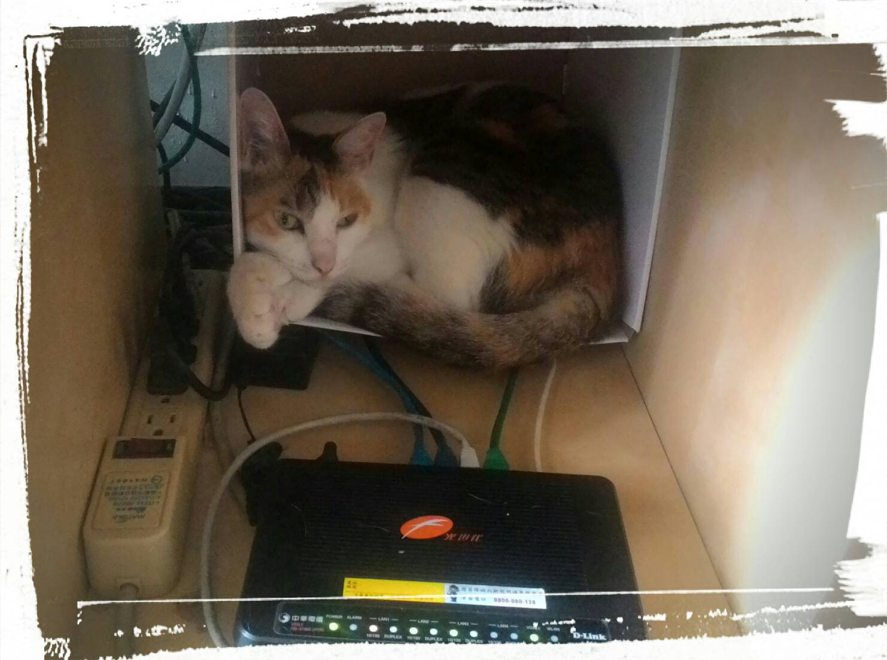

Contains exercises on implementing custom transducers in Clojure.

## Fair notice

Implementing transducers is hard and you may feel confused.


That's normal and to be expected, it happens also to me when I read my own code. Just don't give up.

## No Operation transducer

Implement a transducer that does nothing but passing the data from his input to his output. Functionally speaking, it is an identity transducer.

```clojure
(into [] nop (range 3))
; => [0 1 2]
```

Use it as your transducer template for the following.

## Prepare for battle

* Implement the `(debug in out)` transducer that helps to debug.

```clojure
; We use this function instead of `into` for debugging.
; The reason is that this avoids using transient
; structures which do not `print` nicely.
(defn slow-into [to xf from]
  (transduce xf conj to from))

(slow-into [] (debug "in" "out") (range 3))
;; Outputs:
; in 0
; out [0]
; in 1
; out [0 1]
; in 2
; out [0 1 2]
```

* Add the `(debug)`, `(debug indent)` and `(debug indent in out)` variants for convenience. They are all calling the `(debug in out)` transducer under the hood.

```clojure
(slow-into []
           (comp (debug)
                 (debug 2)
                 (debug 4 ">" "<"))
                 (debug "      >" "      <")) ; 6-spaces prefix
           (range 3))
;; Outputs:
; > 0
;   > 0
;     > 0
;       > 0
;       < [0]
;     < [0]
;   < [0]
; < [0]
; > 1
;   > 1
;     > 1
;       > 1
;       < [0 1]
;     < [0 1]
;   < [0 1]
; < [0 1]
; > 2
;   > 2
;     > 2
;       > 2
;       < [0 1 2]
;     < [0 1 2]
;   < [0 1 2]
; < [0 1 2]
```

Strange patterns, it reminds me of ...

**The PHP Hadouken !!!**


We are now ready to face real transducer implementations and confront an army of problems.

## May I beg your pardon?

You heard me well, I want you to implement the following transducer.

```clojure
(def beg-data (list :may :i :beg :your :pardon :?))

(into [] (beg 2) beg-data)
; => [:may :may :i :i :beg :beg :your :your :pardon :pardon :? :?]
```

Make sure that you are handling the early termination as well.

```clojure
(into []
      (comp (take 3)
            (beg 2))
      beg-data)
; => [:may :may :i :i :beg :beg]
```

Test for both sides.

```clojure
(into []
      (comp (beg 2)
            (take 3))
      beg-data)
; => [:may :may :i]
```

Test with the debug transducer (expect problems and losing some hair).

```clojure
(slow-into []
           (comp (debug 0)
                 (beg 2)
                 (debug 2)
                 (take 3)
                 (debug 4))
           beg-data)
; Output:
; > :may
;   > :may
;     > :may
;     < [:may]
;   < [:may]
;   > :may
;     > :may
;     < [:may :may]
;   < [:may :may]
; < [:may :may]
; > :i
;   > :i
;     > :i
;     < [:may :may :i]
;   < #reduced[{:status :ready, :val [:may :may :i]} 0x8cdcdd1]
; < #reduced[{:status :ready, :val [:may :may :i]} 0x8cdcdd1]

; Result:
; => [:may :may :i]
```

The `beg` transducer should not continue sending data downstream after it receives a reduced result. Fix your implementation if needed.

## All your data are belong to me



Implement the `my-cat` transducer. For each step, you will need to adapt your implementation to the new requirements described by the test samples.

* Step 1, shapeless cat

It functions similarly to `clojure.core/cat`. Don't handle early termination at the moment.

```clojure
(def cat-data [[1 2 :fish 3] [:heat 4] [5 :sleep 6] [7]])

(into [] my-cat cat-data)
; => [1 2 :fish 3 :heat 4 5 :sleep 6 7]
```

* Step 2, hungry cat

As you can see, the transducer is keeping for itself all the fishes and the heat.

```clojure
(into [] my-cat cat-data)
; => [1 2 3 4 5 :sleep 6 7]
```

* Step 3, sleepy cat

That version of the transducer falls asleep an the `:sleep` keyword and do not process any subsequent data.

```clojure
(into [] my-cat cat-data)
; => [1 2 3 4 5]
```

* Step 4, correct cat

At last, we want our transducer to respect the normal early termination (with `reduced?` tested on the downstream result) in a correct manner.

```clojure
(into [] (comp (take 2)
               my-cat)
      cat-data)
; => [1 2 3 4]

(into [] (comp my-cat
               (take 2))
      cat-data)
; => [1 2]

(slow-into [] (comp (debug 0)
                    my-cat    ; try replacing it with `cat` and compare
                    (debug 2)
                    (take 2)
                    (debug 4))
           cat-data)
;; Outputs:
; > [1 2 :fish 3]
;   > 1
;     > 1
;     < [1]
;   < [1]
;   > 2
;     > 2
;     < [1 2]
;   < #reduced[{:status :ready, :val [1 2]} 0x517a7e8e]
; < #reduced[{:status :ready, :val [1 2]} 0x517a7e8e]
```

* Provide an idiomatic equivalent to `my-cat`.


## A.D.D. transducer

* Implement a transducer that daydream during a number of elements. While in the daydream state, it buffers its input. When it stops daydreaming, it processes all of its buffer as a batch, then daydreams again.

The `a-d-d` transducer never loses data.

```clojure
(into [] (a-d-d 3) (range 10))
; => [0 1 2 3 4 5 6 7 8 9]

; Try:
(slow-into [] (comp (debug 0)
                    (a-d-d 3)
                    (debug 2))
           (range 10))
```

* Change `a-d-d` so that it works similarly to `clojure.core/partition-all`.

```clojure
(into [] (a-d-d 3) (range 10))
; => [[0 1 2] [3 4 5] [6 7 8] [9]]
```

* Verify that it works well with early termination.

```clojure
(slow-into [] (comp (debug 0)
                    (a-d-d 3)
                    (debug 2)
                    (take 2))
           (range 10))
; => [[0 1 2] [3 4 5]]
```

## A reducer inside a transducer

Implement `serieduce` which provides a transducer which reduces incoming elements and emits all intermediary elements.

```clojure
(into [] (serieduce conj [1 2]) (range 3 6))
; => [[1 2 3] [1 2 3 4] [1 2 3 4 5]]

(into [] (serieduce +) (range 5))
; => [0 1 3 6 10]
```

## Congratulations if you made it that far!


You are one of a few.
